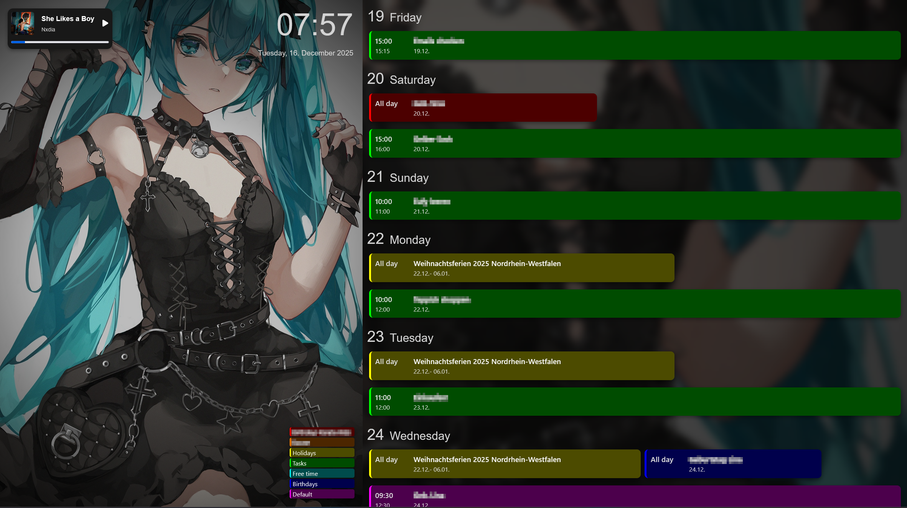
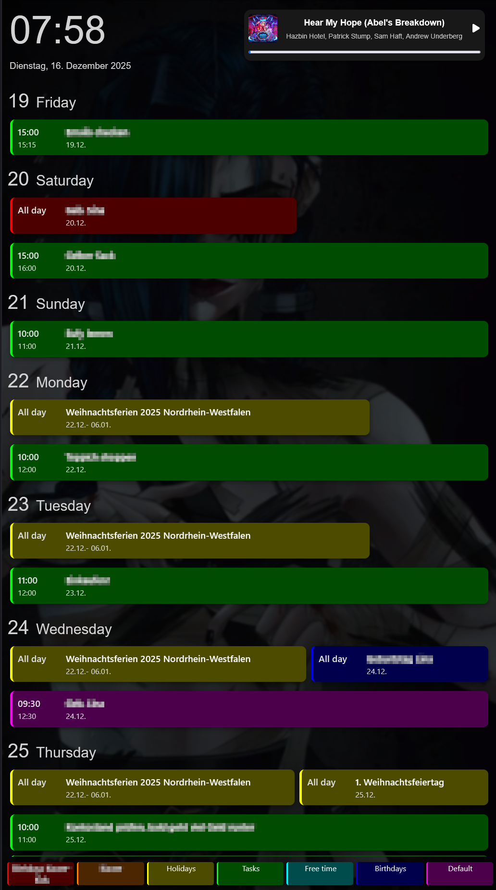
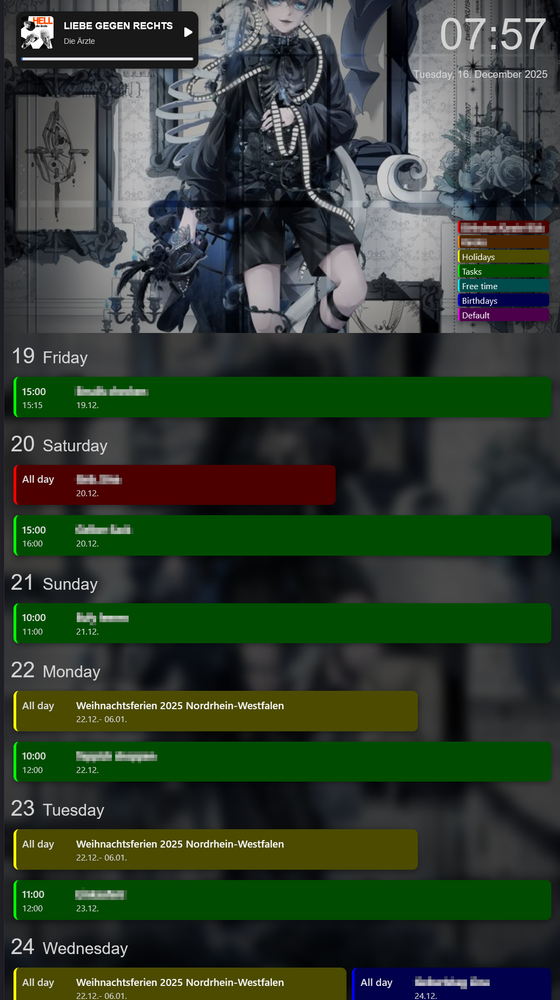
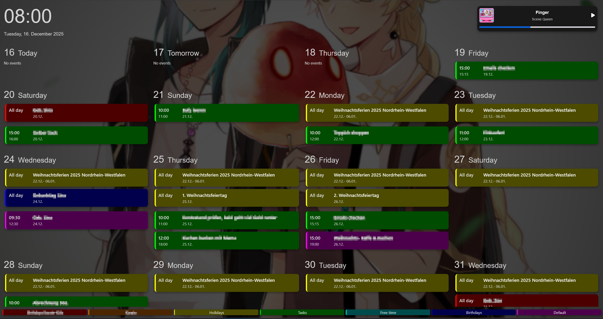
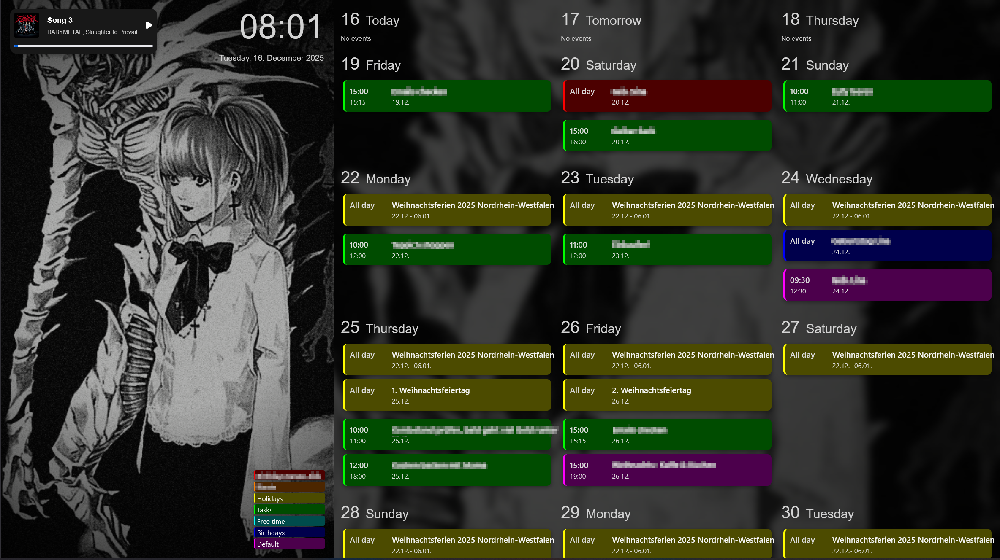

# 🚀 ACAL: Your Personalized Digital Hub for Calendar, Photos, and Music

<!-- TODO: Add project logo -->

<div align="center">

[](https://github.com/ArizonaGreenTea05/ACAL/releases/latest)

[](https://github.com/ArizonaGreenTea05/ACAL/stargazers)
[](https://github.com/ArizonaGreenTea05/ACAL/network)
[](https://sugoi.youtrack.cloud/projects/ACAL/agiles/195-1/current)
[](https://github.com/ArizonaGreenTea05/ACAL/issues)
[](LICENSE)

<a href='https://ko-fi.com/X8X510BA5F' target='_blank'></a>

**ACAL (_ACAL Calendar And Layout_) is a versatile and highly customizable web application designed to help users stay organized and enjoy their digital content. Display photos, manage your calendar, and integrate music all in one elegant interface.**

<!-- [Live Demo](https://demo-link.com) TODO: Add live demo link -->
[📚 Documentation](doc/README.md) | [🚀 Getting Started](doc/user/getting-started.md) | [⚙️ Configuration](doc/user/configuration.md) | [💻 Development Guide](doc/developer/development-guide.md)

</div>

## 📖 Overview

ACAL provides a modern and adaptable solution for visualizing important events, showcasing personal photo collections, and integrating music playback. Built with Blazor Server, it offers a rich interactive user experience while leveraging the robust capabilities of the .NET ecosystem. Whether you're looking to streamline your daily schedule or create a dynamic digital display, ACAL makes it easy to personalize your space and keep everything important in sight.

## ✨ Features

-   🎯 **Interactive Calendar View**: Visualize and manage events with a customizable calendar interface.
-   📸 **Personalized Photo Display**: Showcase cherished memories and dynamic photo albums.
-   🎶 **Integrated Music Player**: Seamlessly control and enjoy your favorite tunes with Spotify integration.
-   🎨 **Customizable Layouts**: Tailor the application's appearance and content arrangement to your preferences.
-   📈 **Efficient Organization**: Stay on top of your schedule and important activities, ensuring you won't miss a thing.
-   ⚙️ **Modular Architecture**: Built with a clean, project-separated structure for maintainability and extensibility.

## 🖥️ Screenshots

### Agenda horizontal (with image)


### Agenda vertical (with/without image)



### Calendar horizontal (with/without image)



## 🛠️ Tech Stack

**Frontend:**


**Backend:**


**DevOps:**

<!--
**Testing:**
-->

## 🚀 Quick Start

### Docker (Recommended)

```bash
docker run -d \
  --name acal \
  -p 5000:8080 \
  -v ~/acal-config:/app/config \
  -v ~/acal-images:/app/images \
  arizonagreentea0905/acal:latest
```

### Manual Installation

```bash
git clone https://github.com/ArizonaGreenTea05/ACAL.git
cd ACAL
dotnet restore
dotnet build
dotnet run --project CalendarView/CalendarView.Web
```

📖 **For detailed installation instructions, see the [Getting Started Guide](doc/user/getting-started.md)**

## 📁 Project Structure

ACAL is organized into multiple projects for maintainability:

-   **CalendarView.Web** - Main Blazor Server application
-   **CalendarView.Shared** - Shared UI components and pages
-   **CalendarView.Services** - Business logic and external services
-   **CalendarView.Core** - Domain models and entities
-   **Common** / **Common.UI** - Shared utilities
-   **Spotify** - Spotify API integration

📖 **For detailed architecture information, see the [Architecture Overview](doc/developer/architecture.md)**

## ⚙️ Configuration

ACAL is configured via `appsettings.json` with support for:

-   🔒 **Authentication** - HTTP Basic Auth with browser-native login
-   🎨 **Design** - Layouts, colors, date/time formats
-   📅 **Calendars** - Multiple ICS sources with custom colors
-   🎵 **Spotify** - Music integration (Premium required)

📖 **For complete configuration reference, see the [Configuration Guide](doc/user/configuration.md)**

## 🔧 Development

```bash
# Clone and setup
git clone https://github.com/ArizonaGreenTea05/ACAL.git
cd ACAL
dotnet restore
dotnet build

# Run tests
dotnet test

# Start development server
dotnet run --project CalendarView/CalendarView.Web
```

📖 **For detailed development setup, see the [Development Guide](doc/developer/development-guide.md)**

## 🚀 Deployment

-   **Docker** - Official image available at [`arizonagreentea0905/acal`](https://hub.docker.com/r/arizonagreentea0905/acal)
-   **Traditional Hosting** - IIS, Nginx, Apache, or cloud platforms

📖 **For production deployment instructions, see the [Deployment Guide](doc/developer/deployment.md)**

## 🤝 Contributing

We welcome contributions! Here's how to get started:

1.  Fork the repository
2.  Create a feature branch (`git checkout -b feat/your-feature-name`)
3.  Make your changes and write tests
4.  Commit with clear messages
5.  Push and open a Pull Request

📖 **For detailed contribution guidelines, see the [Development Guide](doc/developer/development-guide.md)**

**Note:** Request access to our [YouTrack board](https://sugoi.youtrack.cloud/projects/ACAL/agiles/195-1/current) for regular collaboration.

## 📚 Documentation

Comprehensive documentation is available in the [doc](doc/) directory:

### For Users
-   **[Getting Started](doc/user/getting-started.md)** - Installation and first-time setup
-   **[Configuration Guide](doc/user/configuration.md)** - Complete configuration reference
-   **[User Interface Guide](doc/user/user-interface.md)** - Features and layout options
-   **[Troubleshooting](doc/user/troubleshooting.md)** - Common issues and solutions

### For Developers
-   **[Architecture Overview](doc/developer/architecture.md)** - System design and structure
-   **[Development Guide](doc/developer/development-guide.md)** - Setup and contribution workflow
-   **[API Reference](doc/developer/api-reference.md)** - Services, models, and interfaces
-   **[Deployment Guide](doc/developer/deployment.md)** - Production deployment instructions

## 📄 License

This project is licensed under the [MIT License](LICENSE) - see the [LICENSE](LICENSE) file for details.

## 🙏 Acknowledgments

-   Built with the powerful **.NET** platform and **Blazor** framework.
-   Integrates with the **Spotify API** for music functionalities.
-   Inspired by the need for customizable and integrated digital displays.

## 📞 Support & Contact

-   🐛 Issues:
    - Community: [GitHub Issues](https://github.com/ArizonaGreenTea05/ACAL/issues)
    - Developers: [YouTrack Issues](https://sugoi.youtrack.cloud/projects/ACAL/agiles/195-1/current)
-   📧 Contact: [ArizonaGreenTea05](https://github.com/ArizonaGreenTea05) <!-- TODO: Add a more specific contact email if available -->

---

<div align="center">

**⭐ Star this repo if you find it helpful!**

Made with ❤️ by [ArizonaGreenTea05](https://github.com/ArizonaGreenTea05)

</div>
